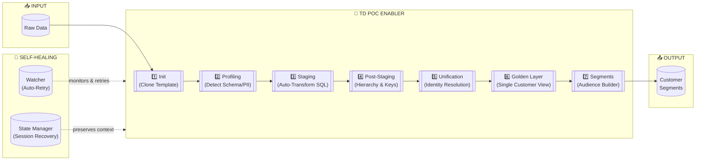
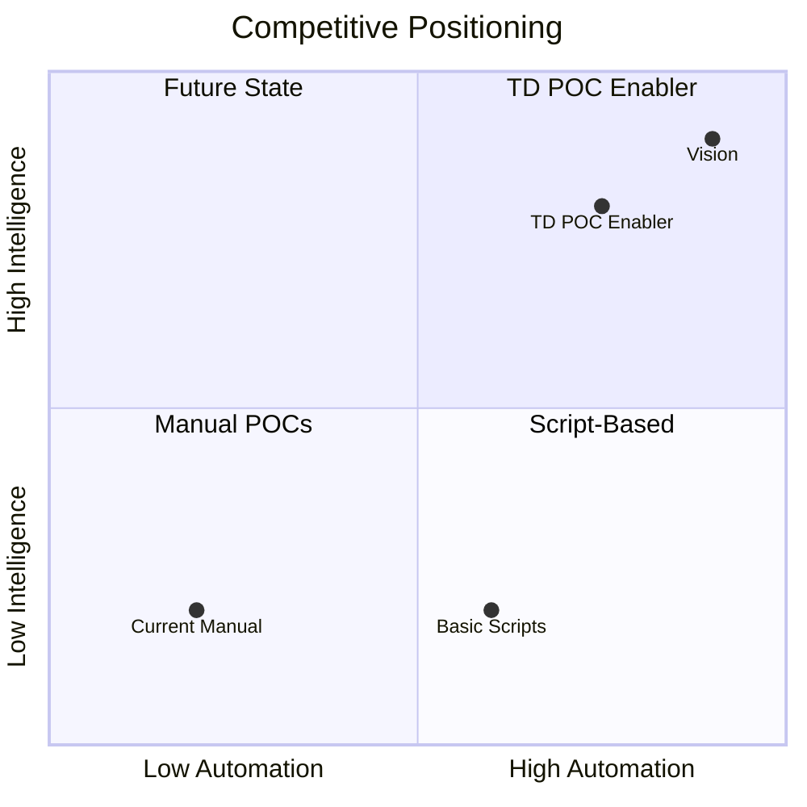

# TD POC Enabler - Executive Presentation

---

## SLIDE 1: Accelerating Customer Data POCs with AI-Powered Automation

### The Challenge

| Current State | Impact |
|---------------|--------|
| Environment setup requires **4-8 hours** per SA | Slow onboarding |
| Data profiling/staging: **~30 min per table** (manual SQL) | Scales poorly with table count |
| Manual error handling and workflow restarts | SA time wasted on retries |
| Session context lost when switching projects | Repeated discovery work |
| Tribal knowledge locked in senior SAs | Limited scalability |

### The Solution: TD POC Enabler

A **self-healing, AI-orchestrated automation toolkit** built on proven GitHub templates.



### Architecture Highlights

| Component | Description |
|-----------|-------------|
| **GitHub Template Foundation** | Built on `se-starter-pack/retail-starter-pack` — proven workflows |
| **Self-Healing Workflows** | Auto-retry failed jobs up to 10x with exponential backoff |
| **Session State Recovery** | `.poc-state/` persists progress — resume anytime without context loss |
| **AI Orchestration** | Claude + TD MCP + TD Skills — intelligent decision-making |
| **Zero-Friction Setup** | `git clone && ./setup.sh` — 5 minutes to productive |
| **Human-in-Loop Approval** | YAML config changes require explicit SA approval |

### Technology Stack

```
┌─────────────────────────────────────────────────────────────────┐
│  Claude CLI + TD Skills Plugin                                  │
│  ├── TD MCP Server (database/workflow operations)               │
│  ├── TDX CLI (AI-native Treasure Data interface)                │
│  ├── State Manager (Python) — session tracking                  │
│  └── Watcher (Node.js) — background monitoring & auto-retry     │
└─────────────────────────────────────────────────────────────────┘
```

---

## SLIDE 2: Return on Investment

### Time Savings Per Table

| POC Phase | Manual | Automated | Savings |
|-----------|--------|-----------|---------|
| Environment Setup | 4-8 hours (once) | 5 minutes | **~97%** |
| Profiling per table | ~30 min | ~2 min | **~93%** |
| Staging SQL per table | ~30 min | ~3 min | **~90%** |
| Error Recovery | Manual restart | Auto-retry | **100%** |
| Session Resume | 1-2 hrs context rebuild | Instant | **100%** |

### Typical POC Impact (10-table scenario)

| Metric | Manual | Automated | Savings |
|--------|--------|-----------|---------|
| Setup | 6 hrs | 5 min | 5.9 hrs |
| Profiling (10 tables) | 5 hrs | 20 min | 4.7 hrs |
| Staging SQL (10 tables) | 5 hrs | 30 min | 4.5 hrs |
| Error handling | 2-4 hrs | 0 (auto) | 3 hrs |
| **Total per POC** | **~18 hrs** | **~1 hr** | **~17 hrs (94%)** |

### Annual Business Value

| Assumption | Value |
|------------|-------|
| Hours saved per POC | ~17 hours |
| POCs per SA per year | 24 |
| Active SAs using toolkit | 10 |
| **Total hours saved/year** | **4,080 hours** |
| Fully-loaded SA rate | $150/hr |
| **Annual value** | **$612,000** |

### Self-Healing ROI Multiplier

| Failure Scenario | Without Self-Healing | With Self-Healing |
|------------------|----------------------|-------------------|
| Transient TD timeout | SA manually restarts | Auto-retry in 5 min |
| Network glitch | Lost progress, restart | Resumes from checkpoint |
| Session interruption | Context rebuild (1-2 hrs) | Instant `/poc-resume` |
| **Estimated additional savings** | — | **+20% efficiency** |

### Strategic Differentiation



| Value Driver | Impact |
|--------------|--------|
| **Scalability** | Junior SAs execute senior-level quality with AI guidance |
| **Consistency** | Every POC follows battle-tested retail starter pack patterns |
| **Knowledge Capture** | Best practices encoded in skills, not tribal knowledge |
| **Faster Wins** | 50%+ faster POC delivery → improved close rates |
| **Template Ecosystem** | Extensible to finance, healthcare, other verticals |

---

## Key Takeaways

> **TD POC Enabler is a self-healing, AI-orchestrated automation toolkit built on proven GitHub templates that reduces POC delivery time by 90%+ while enabling junior SAs to deliver senior-level quality.**

### What Makes It Different

1. **Self-Healing** — Auto-retry with exponential backoff, no manual intervention
2. **Template-Based** — Built on battle-tested `retail-starter-pack` workflows
3. **AI-Orchestrated** — Claude + TD MCP + Skills = intelligent automation
4. **Session-Aware** — Resume POCs anytime without losing context
5. **Human-in-Loop** — SA approves config changes, AI handles execution

### Recommended Next Steps

1. **Pilot** — 2-3 retail POCs with willing SAs
2. **Measure** — Track actual time savings vs. baseline
3. **Iterate** — Incorporate feedback into toolkit
4. **Scale** — Roll out to full PS organization + expand verticals

---

*Technical details: README.md | AI instructions: CLAUDE.md*
